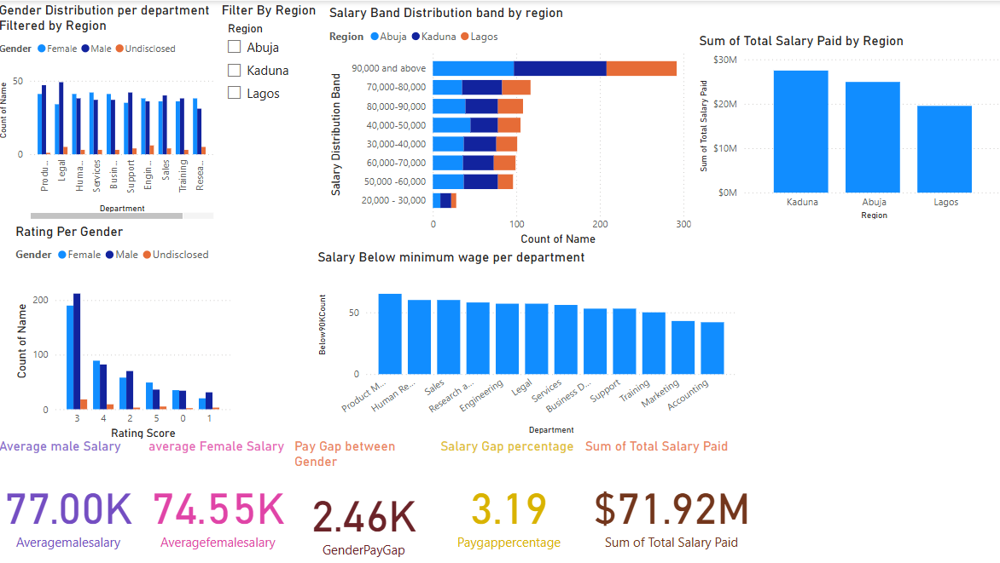

# Palmoria-Group-HR-Diversity-Analysis-Dashboard-Power-BI-
This project presents a strategic analysis of gender-based pay disparities across departments and regions within the Palmoria Group. Built using Microsoft Power BI, the dashboard offers a data-driven view into salary equity, departmental imbalance, and regional trends — supporting inclusive workplace decision-making with clarity and integrity.
## 🧰 Tools & Techniques

**Power BI Desktop**
- Power Query Editor for data wrangling and type handling  
- Relationship modeling to link employee salary, gender, region, and department  
- DAX measures for average salary, gender-based pay gaps, and differences  
- Custom visuals including KPIs, bar charts, percentage delta indicators, and slicers  
- Dashboard layout optimized for clarity, interactivity, and insight delivery  

---

## 🔄 Power BI Workflow

1. **Data Cleaning:** Used Power Query to format and validate HR datasets  
2. **Data Modeling:** Established logical relationships across departments, regions, roles, and gender  
3. **DAX Measures:** Defined calculations for pay gaps, salary averages, gender proportions, and deltas  
4. **Visual Design:** Layered insights using KPIs, tables, and bar visuals with accessible layout  
5. **Insight Synthesis:** Translated visual patterns into actionable recommendations for HR and leadership  

---

## 📈 Key Observations

- **National Pay Gap:** ₹2,455 difference on average — favoring men by 3.19% overall  
- **Regional Disparity:**  
  - *Abuja* has the widest gender gap (3.39%)  
  - *Lagos* shows the narrowest gap (2.73%)  
- **Departmental Imbalance:**  
  - *HR, Business Dev, and Services* pay men significantly more  
  - *Marketing, Training, and Engineering* show a reverse gap — favoring women  
- **Sub-Minimum Wage Flags:** Support and Services roles show multiple entries below statutory salary thresholds  
- **Balanced Ratings:** Gender parity exists in performance ratings — but gaps persist in compensation  

---

## 📸 Dashboard Snapshots

### 💼 Pay Gap Overview – National & Regional Salary Gaps  
This visual provides an executive-level summary of average salaries by gender across regions, including KPIs showing pay differences and percent gaps.

---

### 🏢 Departmental Salary Gap Breakdown by Region  
A comparative view of each department's salary distribution between male and female employees, segmented by Lagos, Kaduna, and Abuja. Clear visual deltas reveal departments with consistent equity issues.

---

### ⚖️ Minimum Wage Compliance & Departmental Ratings  
This layout highlights pay levels under the national minimum wage and shows department-wide performance ratings by gender — revealing imbalances in low-paid departments and clusters of salary concern.

---

## 💡 Strategic Insights

- **Policy Misalignment:** Inconsistent pay practices across regions highlight a need for cross-office salary band reviews — especially in Abuja  
- **Equity Best Practices:** Departments like Engineering and Marketing demonstrate positive deviation; they can serve as role models for equitable compensation  
- **Departmental Bias Risk:** HR and Business Development show large unexplained pay gaps favoring men — requiring closer audit  
- **Statutory Risk Zones:** Support and Services departments may be at risk of wage law noncompliance, requiring intervention  
- **Performance vs. Pay Disconnect:** Equal performance ratings do not always align with equitable salary treatment  

---

## ✅ Recommendations

| Focus Area                  | Strategic Action |
|----------------------------|------------------|
| **Regional Standardization**     | Align salary bands across Lagos, Abuja & Kaduna |
| **Departmental Pay Review**     | Audit HR, Services, and Business Dev compensation levels |
| **Celebrate Equity Champions** | Model Engineering & Marketing pay practices across divisions |
| **Min-Wage Compliance Checks** | Review Support & Services wage data against legal minimums |
| **Ongoing DEI Tracking**       | Deploy the dashboard as a monthly HR insight tool |

---

## 👤 Author

**Ololade Ojobaro**  
Power BI Designer | Inclusive Analytics Advocate | Aspiring Data Analyst

---

